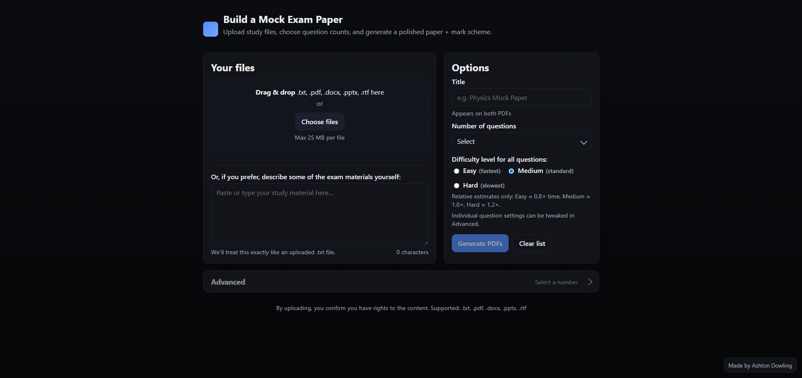
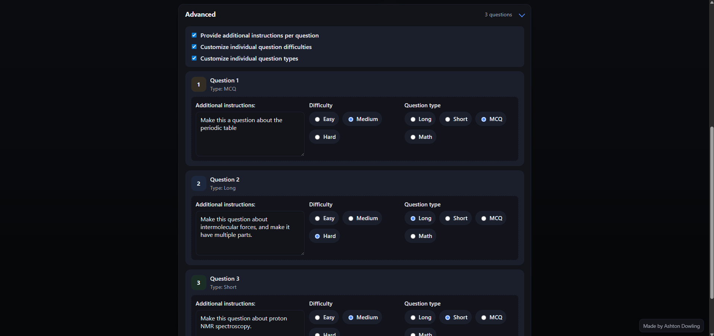
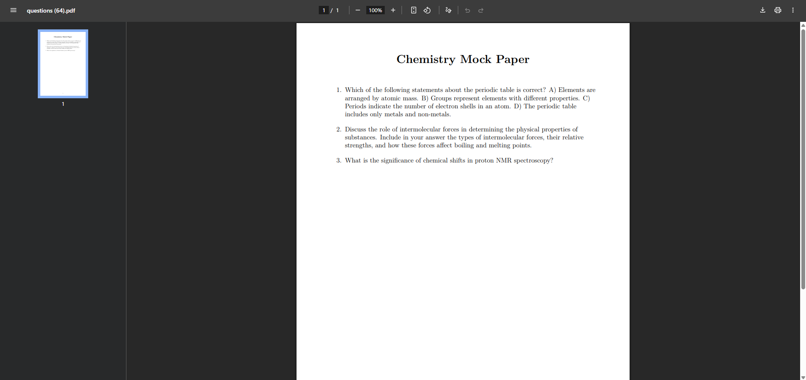
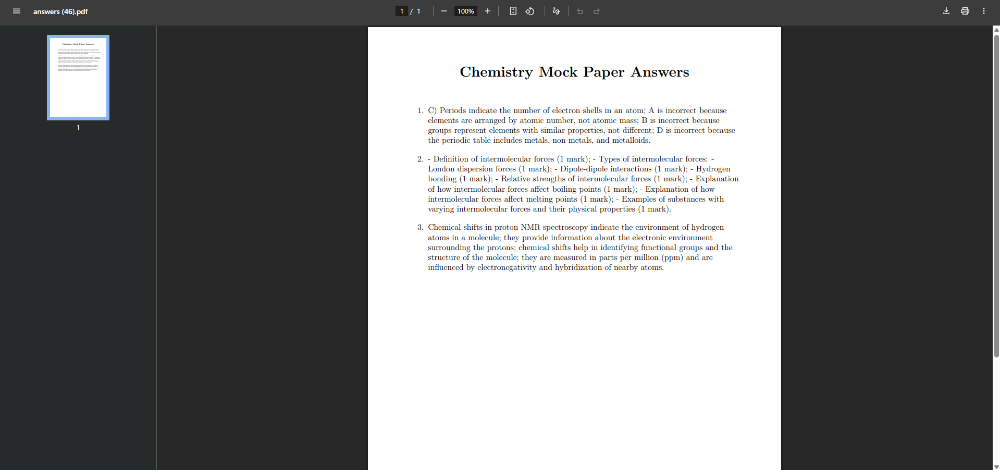

# Exam Paper Generator

A sophisticated AI-powered web application that transforms study materials into professional mock exam papers and comprehensive marking schemes. Built with Flask, OpenAI's GPT models, LaTeX compilation, and advanced OCR processing.

## 🌟 Features

### Core Functionality
- **Multi-format Support**: Process .txt, .pdf, .docx, .pptx, and .rtf files
- **OCR Processing**: Extract text from scanned PDFs and image-based documents using Tesseract OCR
- **AI-Powered Generation**: Uses OpenAI GPT models to create intelligent questions and detailed marking schemes
- **Professional Output**: Generates polished PDF documents using LaTeX/Tectonic compilation
- **Real-time Progress**: Live progress tracking with estimated completion times
- **Advanced Customization**: Per-question control over types, difficulty, and additional instructions

### Question Types
- **Long Answer**: Analytical questions requiring detailed responses (40-120 words)
- **Short Answer**: Concise concept-based questions (8-25 words)  
- **Multiple Choice**: Four-option questions with plausible distractors
- **Math/Calculation**: Mathematical problems with step-by-step solutions

### Security & Performance
- Rate limiting and basic authentication
- File validation and security scanning
- Concurrent processing with thread pools
- Progress pruning and memory management
- Comprehensive error handling

## 🚀 Quick Start

### Prerequisites
- Python 3.8+
- [Tectonic](https://tectonic-typesetting.github.io/) LaTeX engine
- [Tesseract OCR](https://github.com/tesseract-ocr/tesseract) engine
- OpenAI API key

### Installation

1. **Clone and setup**:
```bash
git clone <repository-url>
cd exam-generator
pip install -r requirements.txt
```

2. **Install Tectonic**:
```bash
# On macOS with Homebrew
brew install tectonic

# On Ubuntu/Debian
curl --proto '=https' --tlsv1.2 -fsSL https://drop-sh.fullyjustified.net | sh

# On Windows
# Download from https://github.com/tectonic-typesetting/tectonic/releases
```

3. **Install Tesseract OCR**:
```bash
# On macOS with Homebrew
brew install tesseract

# On Ubuntu/Debian
sudo apt-get install tesseract-ocr tesseract-ocr-eng

# On Windows
# Download from https://github.com/UB-Mannheim/tesseract/wiki
# Add installation folder to PATH (e.g., C:\Program Files\Tesseract-OCR)
```

4. **Environment Configuration**:
```bash
# Required
export OPENAI_API_KEY="your-openai-api-key"

# Optional customization
export OPENAI_BASE_URL="https://api.openai.com/v1"  # Custom endpoint
export APP_MAX_FILES=30                              # Max files per upload
export APP_MAX_FILE_MB=25                           # Per-file size limit
export APP_TOTAL_UPLOAD_MB=100                      # Total upload limit

# OCR Configuration
export APP_ENABLE_OCR=1                             # Enable OCR processing
export APP_OCR_DPI=300                              # OCR render quality
export APP_OCR_LANG=eng                             # Tesseract language
```

5. **Run the application**:
```bash
python exam.py
```

Visit `http://localhost:5000` to access the web interface.

## 📊 Usage

### Basic Workflow

1. **Upload Materials**: Drag and drop or select study files (including scanned PDFs)
2. **Configure Options**: 
   - Set exam title
   - Choose number of questions (1-30)
   - Select difficulty level (Easy/Medium/Hard)
3. **Advanced Settings** (Optional):
   - Customize individual question types
   - Set per-question difficulty levels
   - Add specific instructions per question
4. **Generate**: Click "Generate PDFs" and monitor real-time progress
5. **Download**: Receive professional PDF question paper and marking scheme

### Advanced Question Customization

Click "Advanced" to access per-question controls:

- **Question Types**: Mix Long, Short, MCQ, and Math questions
- **Individual Difficulty**: Override global difficulty per question
- **Additional Instructions**: Add specific requirements (e.g., "Make this a multi-part question about thermodynamics")
- **Drag & Drop Reordering**: Rearrange question order visually

### File Processing

The system intelligently processes various document formats:
- **PDF**: Extracts text using PyMuPDF with pdfplumber fallback, and OCR for scanned/image-based content
- **Word Documents**: Processes .docx files paragraph by paragraph
- **PowerPoint**: Extracts text from .pptx slides and shapes
- **RTF**: Converts rich text format to plain text
- **Text Files**: Supports UTF-8 and UTF-16 encoding

**OCR Processing**: When PDFs contain scanned images or non-selectable text, the system automatically falls back to OCR processing using Tesseract, ensuring maximum text extraction from challenging documents.

## ⚙️ Configuration

### Environment Variables

#### Core Settings
```bash
OPENAI_API_KEY=your-key-here          # Required: OpenAI API key
OPENAI_BASE_URL=custom-endpoint       # Optional: Custom API endpoint
OPENAI_MODEL_MAIN=gpt-4o-mini        # Main generation model
OPENAI_MODEL_SUMMARY=gpt-4o-mini     # Summarization model
```

#### File Limits
```bash
APP_MAX_FILES=30                      # Maximum files per upload
APP_MAX_FILE_MB=25                   # Per-file size limit (MB)
APP_TOTAL_UPLOAD_MB=100              # Total upload limit (MB)
APP_TXT_CHAR_LIMIT=1000000           # Text file character limit
APP_PDF_PAGE_LIMIT=2000              # PDF page processing limit
```

#### OCR Settings
```bash
APP_ENABLE_OCR=1                     # Enable/disable OCR processing
APP_OCR_DPI=300                      # OCR render quality (150-600)
APP_OCR_LANG=eng                     # Tesseract language codes
APP_OCR_PAGE_LIMIT=2000              # Max pages to OCR process
```

#### Performance Tuning
```bash
APP_SUMMARY_TOKENS=350               # Target summary length
APP_Q_INPUT_CAP=12000               # Question generation input cap
APP_Q_OUT_CAP=4000                  # Question output token limit
APP_A_OUT_CAP=2500                  # Answer output token limit
TECTONIC_TIMEOUT=45                 # LaTeX compilation timeout
```

#### Security & Rate Limiting
```bash
APP_BASIC_AUTH=1                     # Enable basic authentication
APP_USER=admin                       # Auth username
APP_PASS=secure-password            # Auth password
APP_RATE_UPLOADS_PER_MIN=6          # Upload rate limit
APP_RATE_STATUS_PER_10S=50          # Status check rate limit
APP_RATE_DOWNLOADS_PER_MIN=60       # Download rate limit
```

### Difficulty Profiles

Each difficulty level adjusts generation behavior:

- **Easy**: Shorter questions, stable generation, core topics focus
- **Medium**: Balanced approach, moderate complexity
- **Hard**: Longer scenarios, multi-step reasoning, edge cases

## 🏗️ Architecture

### Backend Components

```
exam.py
├── Flask Application Setup
├── File Processing Pipeline
│   ├── Multi-format document parsing
│   ├── OCR text extraction with Tesseract
│   ├── Content validation and security
│   └── Text extraction and normalization
├── AI Generation Pipeline
│   ├── Intelligent summarization
│   ├── Question generation with blueprints
│   └── Marking scheme creation
├── LaTeX Processing
│   ├── Mathematical notation handling
│   ├── Template-based PDF generation
│   └── Tectonic compilation
└── Progress & Security Systems
    ├── Real-time progress tracking
    ├── Rate limiting and authentication
    └── Error handling and recovery
```

### Frontend Features

- **Modern UI**: Dark/light mode support with smooth animations
- **Drag & Drop**: Intuitive file upload with visual feedback
- **Advanced Controls**: Collapsible per-question customization
- **Progress Visualization**: Real-time progress with step-by-step breakdown
- **Responsive Design**: Works on desktop and mobile devices

### Processing Pipeline

1. **File Ingestion**: Multi-threaded document processing with OCR fallback
2. **Content Analysis**: Token estimation and summarization planning
3. **AI Generation**: Blueprint-driven question and answer creation
4. **LaTeX Compilation**: Mathematical notation processing and PDF generation
5. **Delivery**: Secure download links with progress completion

## 🔧 API Endpoints

### Core Endpoints
- `GET /` - Main application interface
- `POST /upload` - File upload and generation trigger
- `GET /status?job=<id>` - Real-time progress polling
- `POST /cancel` - Cancel ongoing generation
- `GET /download/<type>` - Download generated PDFs

### Utility Endpoints
- `GET /healthz` - Health check (liveness probe)
- `GET /readyz` - Readiness check with dependency validation
- `GET /smoke/local` - LaTeX compilation test

## 🛡️ Security Features

### Input Validation
- File type and content verification
- Size limits and zip bomb protection
- Content sanitization for LaTeX injection prevention
- PDF encryption detection

### Rate Limiting
- Per-IP upload limits
- Status polling rate limits
- Download frequency controls
- Configurable thresholds

### Authentication
- Optional basic authentication
- Request ID tracking
- Security headers (X-Frame-Options, CSP-ready)
- Input sanitization

## 🐛 Troubleshooting

### Common Issues

**Tectonic Not Found**
```bash
# Verify installation
tectonic --version

# Add to PATH if needed
export PATH="$HOME/.cargo/bin:$PATH"
```

**Tesseract OCR Issues**
```bash
# Verify installation
tesseract --version

# Check language data
tesseract --list-langs

# On Windows, ensure PATH includes Tesseract folder
# e.g., C:\Program Files\Tesseract-OCR
```

**LaTeX Compilation Errors**
- Check `/readyz` endpoint for system status
- Review mathematical notation in source materials
- Increase `TECTONIC_TIMEOUT` for complex documents

**File Processing Failures**
- Verify file isn't corrupted or password-protected
- Check file size against configured limits
- Ensure proper file extensions
- For scanned PDFs, verify OCR is enabled (`APP_ENABLE_OCR=1`)

**OCR Performance Issues**
- Reduce `APP_OCR_DPI` for faster processing (try 150-200)
- Increase `APP_OCR_PAGE_LIMIT` if needed
- Check Tesseract language data for non-English content

**OpenAI API Issues**
- Verify API key validity
- Check rate limits on OpenAI account
- Monitor token usage for large documents

### Debug Mode
```bash
export FLASK_DEBUG=1
python exam.py
```

## 📋 Dependencies

### Core Requirements
```
flask>=2.3.0
openai>=1.0.0
python-dotenv>=1.0.0
werkzeug>=2.3.0
```

### Document Processing
```
python-docx>=0.8.11
PyMuPDF>=1.23.0
pdfplumber>=0.9.0
python-pptx>=0.6.21
striprtf>=0.0.26
pytesseract>=0.3.10
Pillow>=9.0.0
```

### System Requirements
- **Tectonic**: LaTeX engine for PDF compilation
- **Tesseract OCR**: Text extraction from images and scanned documents
- **Python 3.8+**: Core runtime
- **OpenAI API**: GPT model access

## 📄 License

This project is designed for educational and internal use. Please ensure compliance with OpenAI's usage policies and any institutional requirements.

## 🤝 Contributing

For improvements and bug fixes:
1. Fork the repository
2. Create a feature branch
3. Test thoroughly with various document types (including scanned PDFs)
4. Submit a pull request with detailed description

## 📞 Support

For issues and questions:
- Check the troubleshooting section
- Review logs for detailed error messages
- Verify environment configuration (including OCR setup)
- Test with the `/smoke/local` endpoint for LaTeX functionality
- Use debug mode to check OCR processing for problematic PDFs

## 📸 Demo

### Screenshots

 



### Live Demo
[Try it here](your-deployed-url) (Note: Requires OpenAI API key)

### Video Walkthrough
[2-minute demo video](youtube-link)
